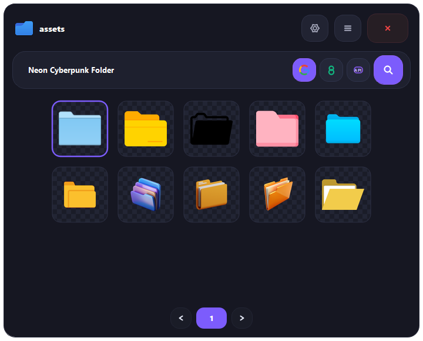
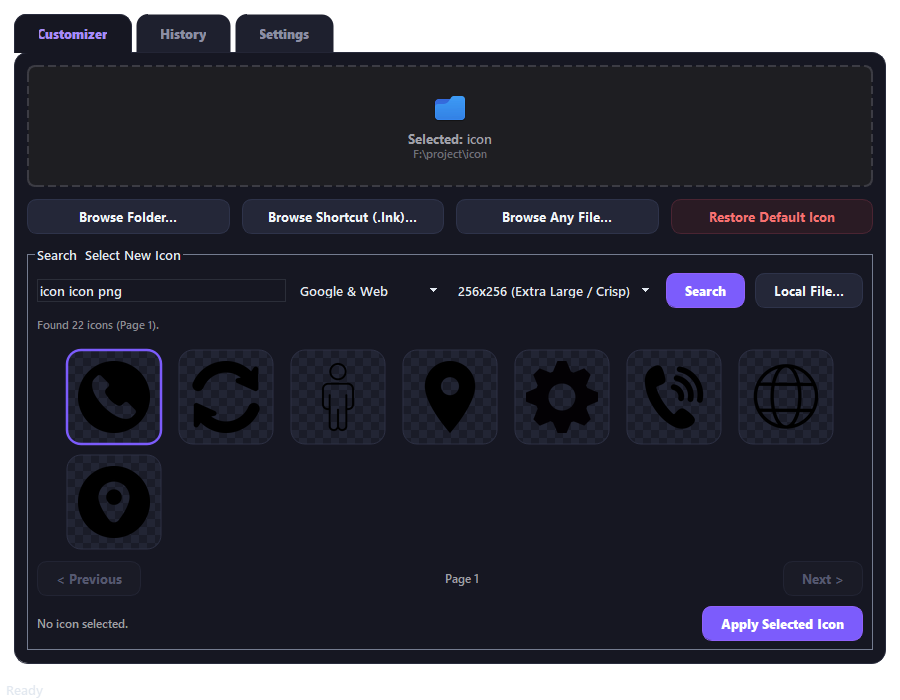
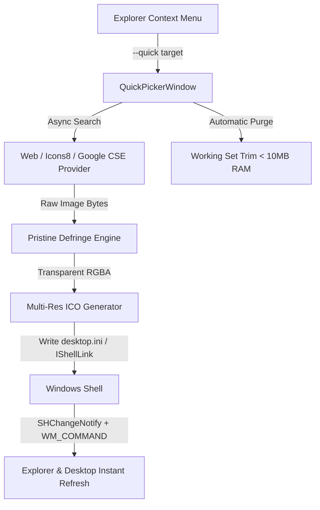

<div align="center">

  

  # ixon

  ### Modern Windows Icon Customizer & Shell Integration Tool

  <p align="center">
    <b>Instantly search, customize, and apply high-definition transparent icons to folders, shortcuts, and files with zero lag.</b>
  </p>

  <p align="center">
    <a href="https://github.com/devilmancrybabyx/ixon/releases/latest"></a>
    <a href="https://github.com/devilmancrybabyx/ixon/releases"></a>
    
    
    <a href="LICENSE"></a>
    
  </p>

  <p align="center">
    <a href="#-quick-download"><b>📥 Download Release</b></a> •
    <a href="#-key-features"><b>✨ Features</b></a> •
    <a href="#-visual-previews"><b>📸 Previews</b></a> •
    <a href="#-quick-start"><b>🚀 Quick Start</b></a> •
    <a href="#-keyboard-shortcuts"><b>⌨ Shortcuts</b></a> •
    <a href="#-architecture--performance"><b>🧠 Architecture</b></a>
  </p>

  <br />

  

</div>

---

## ⚡ Highlights

**ixon** replaces the clunky 1990s Windows "Change Icon" dialog with an ultra-responsive, neumorphic popup right at your mouse cursor. Right-click any folder or shortcut, choose from live high-res transparent web results or vector icon libraries, and apply instantly with automated multi-size `.ico` generation.

- 🪄 **Pristine Edge Defringing**: Proprietary vectorized edge erosion and color un-matting completely eliminates ugly white halo outlines around transparent icons.
- 🚀 **Zero-Lag Explorer Refresh**: Uses Windows Shell notification (`SHChangeNotify`) and window broadcasting (`WM_COMMAND`) to update icons immediately without restarting `explorer.exe`.
- 🪶 **Ultra-Lightweight (<10 MB RAM)**: Active working set memory trimmer purges resident memory down to ~5 MB (idle <1 MB). Single-process enforcement prevents zombie background tasks.
- 🛡 **Zero UAC Annoyances**: Installs cleanly into `HKEY_CURRENT_USER\Software\Classes` without requesting admin privileges or triggering elevation prompts for regular folders.

---

## 📸 Visual Previews

<div align="center">

### 1. Minimalist Quick Context-Menu Picker
*Frameless floating card, animated hamburger menu, instant provider switching, and vector icons.*


### 2. Full Application Workspace & History
*Drag-and-drop customization, multi-source search query templates, and 1-click restore for all customized items.*



</div>

---

## ✨ Key Features

| Feature | Description |
| :--- | :--- |
| **Instant Right-Click Popup** | Right-click any folder, shortcut (`.lnk`), or file in Explorer and select **"Change Icon"**. |
| **Multi-Engine Search** | Search across **Google & Web Images**, **Icons8 (1.5M+ Vector Icons)**, and official **Google Custom Search API**. |
| **Pristine Transparency** | Automatic background floodfill + vectorized defringing removes halos, artifacts, and anti-aliasing white borders. |
| **Multi-Resolution .ICO** | Packs 256×256, 128×128, 64×64, 48×48, 32×32, and 16×16 bitmaps so icons stay razor-sharp in every Explorer view mode. |
| **Local File Support** | Extract high-res icons from `.exe`, `.dll`, `.ico`, `.png`, `.jpg`, and `.webp` files. |
| **1-Click Restore** | Restore default Windows folder or shortcut icons with a single click. |
| **Animated Feedback** | Smooth checkmark overlay animation confirms customization upon selection. |

---

## 📥 Quick Download

Grab the latest standalone release from the [GitHub Releases page](https://github.com/devilmancrybabyx/ixon/releases/latest):

| Asset | Format | Description |
| :--- | :--- | :--- |
| **[IconChanger-v1.0.0-Windows-x64.zip](https://github.com/devilmancrybabyx/ixon/releases/latest)** | `.zip` | Portable release bundle. Extract anywhere and launch immediately. |
| **[IconChanger.exe](https://github.com/devilmancrybabyx/ixon/releases/latest)** | `.exe` | Standalone executable binary. |

---

## 🚀 Quick Start

### 1. Enable Windows Explorer Context Menu (1-Click)
Run `IconChanger.exe` with the `--install` flag, or click **Install** in the Settings tab:
```cmd
IconChanger.exe --install
```
> *Installs to `HKCU:\Software\Classes` without requiring administrator privileges or UAC popups.*

### 2. Customize an Icon
1. In Windows Explorer or on your Desktop, **right-click** any folder or shortcut.
2. Select **"Change Icon"**.
3. Type a keyword (or use the auto-populated folder name).
4. Click your desired icon — it converts, applies to `desktop.ini` / `IShellLink`, refreshes the desktop, and closes automatically!

---

## ⌨ Keyboard Shortcuts

| Shortcut | Action |
| :---: | :--- |
| `Arrow Keys` | Navigate through search result cards |
| `Enter` / `Return` | Apply selected icon card (or trigger search if input focused) |
| `Esc` | Close Quick Picker |
| `F5` | Refresh current search query |

---

## 🛠 Running from Source

If you prefer building or running from Python source:

### Prerequisites
- Windows 10 or 11 (64-bit)
- Python 3.10+ (Python 3.12 recommended)

### Setup
```bash
# Clone the repository
git clone https://github.com/devilmancrybabyx/ixon.git
cd ixon

# Install dependencies
pip install -r requirements.txt

# Run Quick Picker for a target folder
python run.py --quick "C:\path\to\your\folder"

# Or run the full desktop program
python run.py
```

### Compiling with PyInstaller
```bash
python build_exe.py
```
Compiled output will be placed in `dist/IconChanger/IconChanger.exe`.

---

## 🧠 Architecture & Performance



- **Folder Customization**: Uses Windows `SHGetSetFolderCustomSettings` with UTF-16LE `desktop.ini` and applies `FILE_ATTRIBUTE_SYSTEM | FILE_ATTRIBUTE_READONLY`.
- **Shortcut Customization**: Leverages Windows COM `IShellLinkW` / `WScript.Shell` for instant shortcut icon redirection.
- **Defringing Algorithm**: Evaluates boundary pixels touching transparency channels, strips outer white halos (`r > 185, g > 185, b > 185`), and un-mattes anti-aliased edge blends using `(color - (1 - alpha) * 255) / alpha`.
- **Memory Optimization**: Leverages `kernel32.SetProcessWorkingSetSize` with `-1` purge flags to keep active RAM below 10 MB, alongside single-instance process cleanup.

---

## 📄 License

Distributed under the **MIT License**. See [`LICENSE`](LICENSE) for more details.

<div align="center">
  <sub>Built with ❤️ for Windows customization enthusiasts by <a href="https://github.com/devilmancrybabyx">@devilmancrybabyx</a></sub>
</div>
